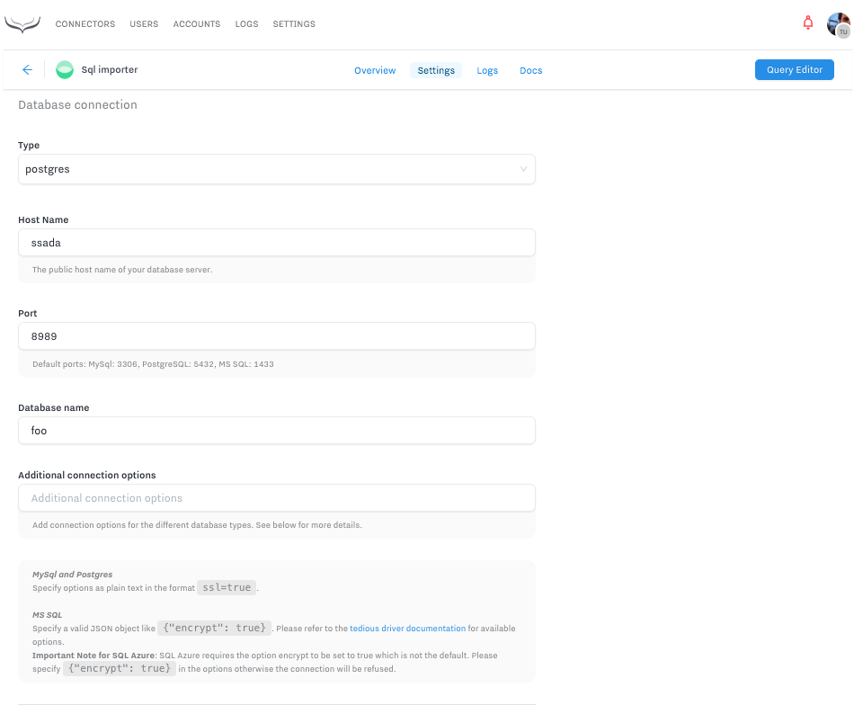
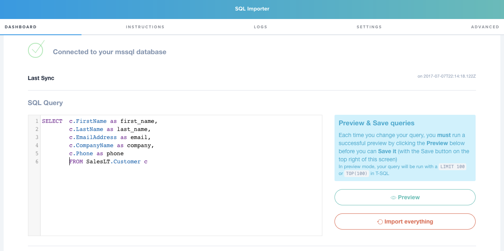
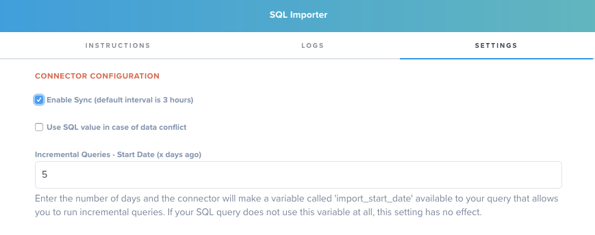
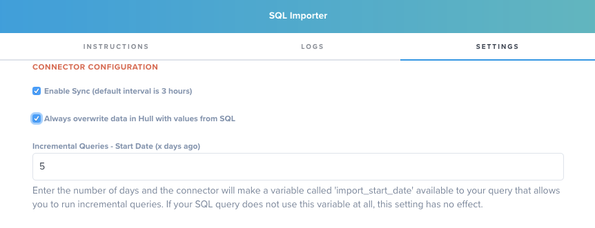
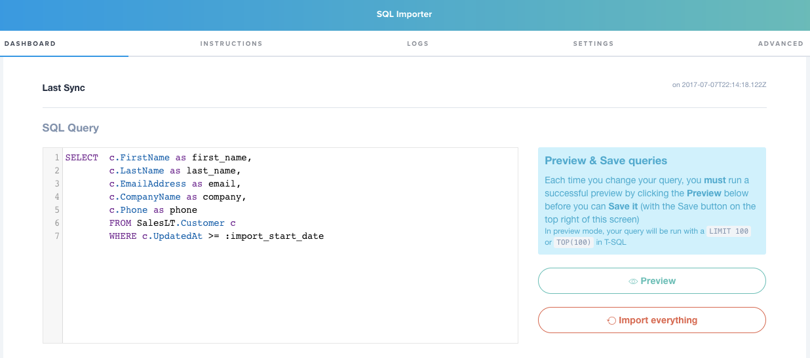

# Hull SQL Connector

The Hull SQL Connector makes it easy to bring data from your SQL databases into Hull by  writing your own queries.

## Getting Started

Go to the Connectors page of your Hull organization, click the button “Add Connector” and click “Install” on the Sql importer card. After installation, switch to the “Settings” tab and begin with the configuration.

Begin your configuration in the section **Database Connection** by selecting the type of your SQL database. Next specify other connection parameters such as host name and port:

Move on to the section **Database Login** and specify the user credentials:

To complete your configuration, save your changes to the settings. You can now move on to the tab “Dashboard” and write your SQL query:

Click on the button “Preview” to check if your query is working and delivering the results you expect. Once you are satisfied with the result, save your changes. The SQL connector will run the query on a given interval (3 hours per default) once you enable the sync (see Synchronize data on a scheduled basis for further details). If you want to start the import directly, click on the button “Import everything” and we will get you going right away.

## Features

The SQL connector supports to `create users`, `add traits` and `update traits`.

You can bring in new users or update existing user profiles from your SQL databases to create segments, transform and enrich customer data and send them to other services with our other Connectors.

Hull SQL Connector allows you to synchronize data on a given schedule, define how data is treated in terms of conflicts and run incremental queries.

## Synchronize data on a scheduled basis

**Enable Sync** to run your query on a given time interval to keep your data automatically up-to-date:

By checking the box your query runs automatically every 3 hours. To increase performance we recommend to use incremental queries.

Note: You can always manually run your query from the dashboard by clicking on the button “Import everything”.

## Define behavior in case of a data conflict

A user profile in Hull is usually composed of data from a multitude of sources, so it is likely that you have already stored a value for a given trait and your SQL data source returns a different value. Let’s say you have already stored the phone number 123-444-6666 in the user profile for Brad Smith but your query returns the number 456-233-8899. This represents a typical data conflict and you can decide how the SQL connector shall resolve this conflict: either keep the number or overwrite it. By selecting **Use SQL value in case of data conflict** in the connector configuration section, you make the decision that your SQL data source is the leading system for the particular traits it returns:

Note: The default behavior is to use the SQL value in case of data conflict. This is consistent across all connectors in Hull.

## Query data that has changed in a given time period (Incremental Queries)

If the tables in your SQL database hold large sets of data, you might want to query only data that has changed within the last couple of days - this is what we call incremental queries. The advantage of incremental queries is that you return a smaller subset of data that can be processed faster which improves the overall performance. You can write an incremental query by using the placeholder `:import_start_date`  in your query string. The SQL connector will automatically replace this at runtime with a proper datetime value that represents the current point of time x days ago. Here is an example of an incremental query:

You can define the number of days on the tab “Settings“ in the section “Connector Configuration”:

Please enter the number of days as integer or whole number. Fractional days are not supported.

## Supported SQL Server Types

- Redshift
- PostgreSQL
- MySQL
- Microsoft SQL

## Troubleshooting

Every connector can return different errors - they will be shown when previewing query results or in connector logs (`import.job.error` message):

|Error message|Root cause|Possible solution|
|---|---|---|
|Connection Error|Connector could not connect to the database|Double check database credentials, error message may contain additional infromation|
|Connection Timeout|Connector could not access the database in provided time|Check database availability, its IP whitelist, port and hostname|
|Query Timeout|Connector could not get query results in provided time|Database server may be too slow to process query, the query may be too complex or sync interval is too short|
|Database Error|There was an error thrown by database during query execution|Please refer to error message to get details|

Also connector would set one of those statuses:

|Status|Message|
|---|---|
|`error`|Connection parameters are not fully configured|
|`error`|Error when trying to connect with database|
|`error`|Query is not configured|
|`warning`|Sync is disabled. Enable it in settings.|
|`error`|Interval syncing is enabled but interval time is less or equal zero.|
