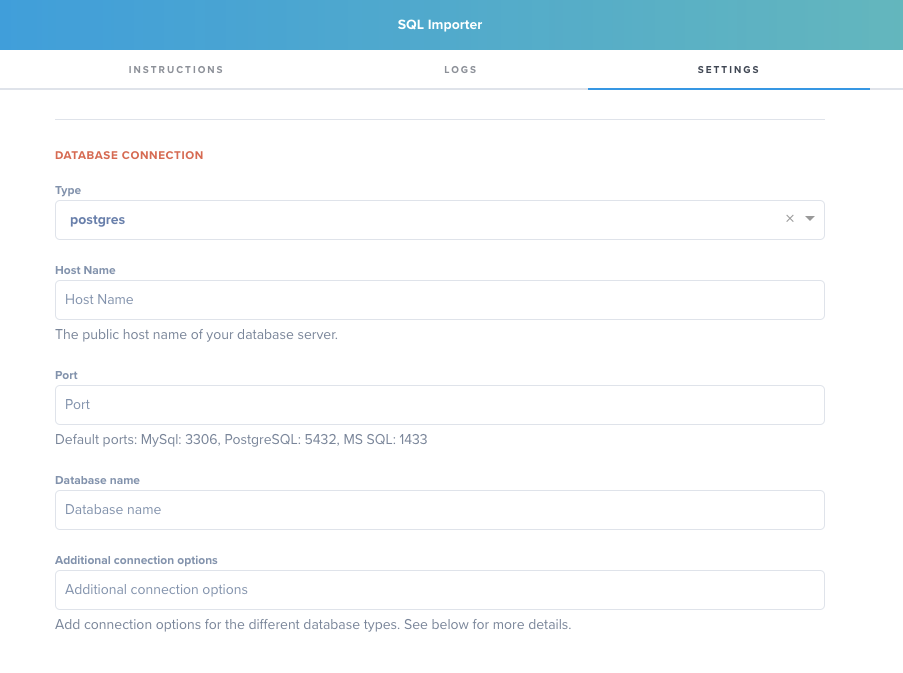
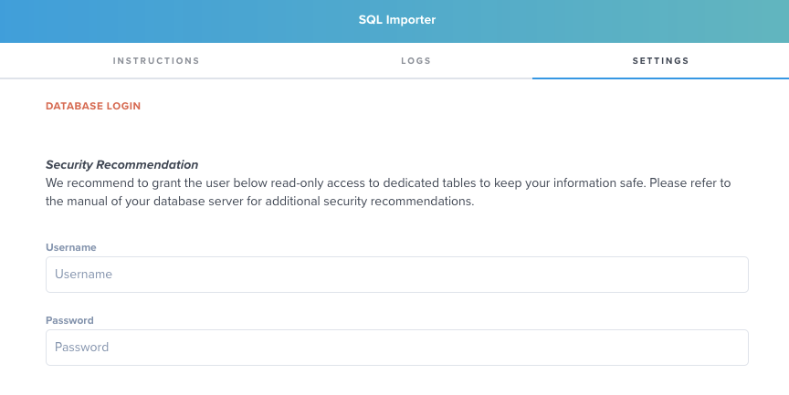

# Hull SQL Connector

The Hull SQL Connector makes it easy to bring data from your SQL databases into Hull by  writing your own queries.

## Getting Started

Go to the Connectors page of your Hull organization, click the button “Add Connector” and click “Install” on the Sql importer card. After installation, switch to the “Settings” tab and begin with the configuration.

Begin your configuration in the section **Database Connection** by selecting the type of your SQL database. Next specify other connection parameters such as host name and port:


Move on to the section **Database Login** and specify the user credentials:


To complete your configuration, save your changes to the settings. You can now move on to the tab “Dashboard” and write your SQL query:


Click on the button “Preview” to check if your query is working and delivering the results you expect. Once you are satisfied with the result, save your changes. The SQL connector will run the query on a given interval (3 hours per default) once you enable the sync (see Synchronize data on a scheduled basis for further details). If you want to start the import directly, click on the button “Import everything” and we will get you going right away.

## Features

The SQL connector supports various types of entities. Select what you want to import in the Settings:


### Entities: Users and Accounts

The SQL connector, when importing the results will `create` or `update` users and accounts that are returned, and will `add` or `update` attributes to the resolved entities. (Update only happens if the Overwrite setting is set)

You can bring in new entities or update existing user profiles from your SQL databases to create segments, transform and enrich customer data and send them to other services with our other Connectors.

If you activate the `Enable Sync` toggle, the Hull SQL Connector will run on a defined schedule automatically, and you to import data on a given schedule. See the section below

You can link Users to Accounts by exposing an `account_id` column in the results of a Users query, which will link the User to the Account's `external_id` in Hull.

### Events

You can import User Events and associate them to the Users in Hull by providing one of the identifiers. We don't support Account events today.

Valid queries MUST expose an `external_id` column matching a user's `external_id`, an `event` column specifying the event name or type and a `timestamp` column.

Lines with no `external_id`, `event` and `timestamp` will be ignored.

All other fields will be imported as event properties. For example, the following query will map the column `users.id` to your Hull users' `external_id`.

```
SELECT user_id as external_id, event, timestamp FROM users_events
```

If you import User Events, a best practice is to provide an immutable value for the Event's `id` so that events aren't duplicated. We strongly recommend you provide an `event_id` column to ensure event unicity.


## Synchronizing data on a scheduled basis

If you activate the `Enable Sync` checkbox, your query will run on a given time interval to import the data on a regular schedule.

By default, the query runs automatically every 3 hours. You can select the interval here to balance performance and load.
To increase performance we recommend to use incremental queries (see below).

Note: If the `Enable Sync` checkbox is disabled, the query won't run automatically (this is the default).
You can still run one-off imports from the Query Editor screen by clicking on the button “Import everything” after a successful preview.

## Define behavior in case of a data conflict

A user profile in Hull is usually composed of data from a multitude of sources, so it is possible that you have already stored a value for a given trait and your SQL data source returns a different value. Let’s say you have already stored the phone number `123-444-6666` in the user profile for Brad Smith but your query returns the number `456-233-8899`. This represents a typical data conflict and you can decide how the SQL connector shall resolve this conflict: either keep the number or overwrite it. By selecting `Use SQL value in case of data conflict` in the connector configuration section, you make the decision that your SQL data source is the leading system for the particular traits it returns:

Note: The default behavior is to use the SQL value in case of data conflict. This is consistent across all connectors in Hull.

## Query data that has changed in a given time period (Incremental Queries)

If the tables in your SQL database hold large sets of data, you might want to query only data that has changed within the last couple of days - this is what we call **incremental queries**. The advantage of incremental queries is that you return a smaller subset of data that can be processed faster which improves the overall performance and reduces your number of Incoming requests.

You can write an incremental query by using the placeholder `:import_start_date`  in your query string. The SQL connector will automatically replace this at runtime with a proper datetime value that represents the current point of time x days ago. Here is an example of an incremental query:

```
SELECT id as external_id, email as email, firstname as first_name
FROM users
WHERE updated_at >= :import_start_date
```

You can define the number of days on the tab “Settings“ in the section “Connector Configuration”:

Please enter the number of days as integer or whole number. Fractional days are not supported.

## Supported SQL Server Types

Today, we support the following databases types: 
- Redshift
- PostgreSQL
- MySQL
- Microsoft SQL

Please contact us if you need support for another database!
